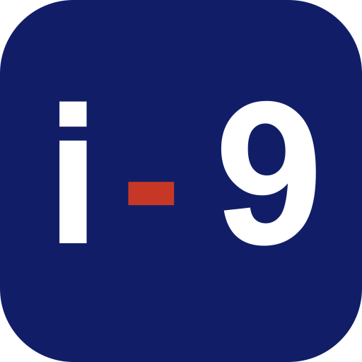

  

<h1 align="center">i-9.ai</h1>

  IA aplicada ao trabalho real · AI for real work · IA aplicada al trabajo real

  <a href="#português">Português</a> ·
  <a href="#english">English</a> ·
  <a href="#español">Español</a>

## Português

A i-9.ai ajuda empresas a entender onde IA e automação podem melhorar o
trabalho real antes de escolher ferramentas ou ampliar a solução.

Partimos de processos, decisões, repetições, esperas e exceções. A partir dessa
leitura, desenhamos testes delimitados, automações e sistemas assistidos por IA
com supervisão humana, permissões, privacidade, rastreabilidade e critérios de
sucesso proporcionais ao risco.

Nosso trabalho pode incluir:

- diagnóstico e tradução operacional;
- pilotos de automação e assistência por IA;
- agentes e integrações conectados ao fluxo de trabalho;
- bases de conhecimento, governança e continuidade operacional.

[Site institucional](https://i-9.ai/) · [Blog](https://blog.i-9.ai/)

## English

i-9.ai helps companies understand where AI and automation can improve real
work before choosing tools or expanding a solution.

We start with processes, decisions, repetition, waits, and exceptions. From
that operational reading, we design bounded tests, automations, and AI-assisted
systems with human oversight, permissions, privacy, traceability, and success
criteria proportionate to risk.

Our work may include:

- operational diagnosis and translation;
- automation and AI-assistance pilots;
- agents and integrations connected to the workflow;
- knowledge bases, governance, and operational continuity.

[Institutional site](https://i-9.ai/en/) · [Blog](https://blog.i-9.ai/en/)

## Español

i-9.ai ayuda a las empresas a entender dónde la IA y la automatización pueden
mejorar el trabajo real antes de elegir herramientas o ampliar una solución.

Partimos de procesos, decisiones, repeticiones, esperas y excepciones. A partir
de esa lectura operativa, diseñamos pruebas acotadas, automatizaciones y
sistemas asistidos por IA con supervisión humana, permisos, privacidad,
trazabilidad y criterios de éxito proporcionales al riesgo.

Nuestro trabajo puede incluir:

- diagnóstico y traducción operativa;
- pilotos de automatización y asistencia con IA;
- agentes e integraciones conectados al flujo de trabajo;
- bases de conocimiento, gobernanza y continuidad operativa.

[Sitio institucional](https://i-9.ai/es/) · [Blog](https://blog.i-9.ai/es/)
